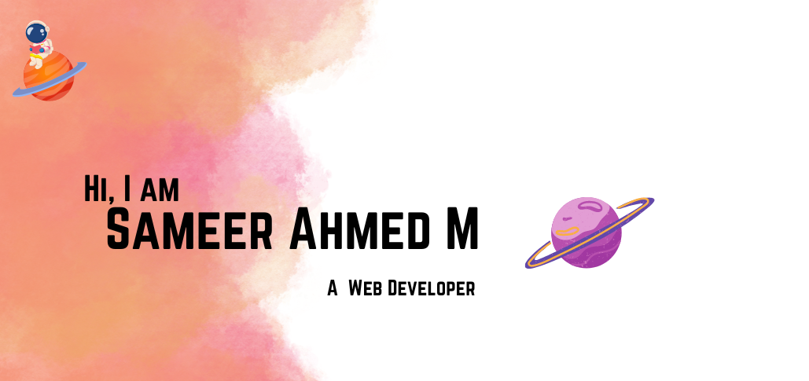

# Hi There 😊

*👋 Hi, I’m Sameer Ahmed, an entry-level web developer passionate about building clean, responsive websites. My expertise includes HTML, CSS, and JavaScript, and I’m continuously expanding my knowledge of modern web technologies. I enjoy working on creative projects that challenge me to learn and grow. Whether it’s solving a tricky coding problem or refining a user interface, I’m always looking for ways to improve my skills. Currently, I’m focusing on enhancing my JavaScript abilities and diving into frameworks like React. Let’s connect and collaborate on exciting projects!*

## My Coding Skills :point_down:

- **Languages** -

     
    
    
  
- **Developed Environment**  - 

      
       
  
- **Version Control** -

    

## Currently Learning :seedling:

 

## How To Reach me :mailbox_with_no_mail:

 
 

